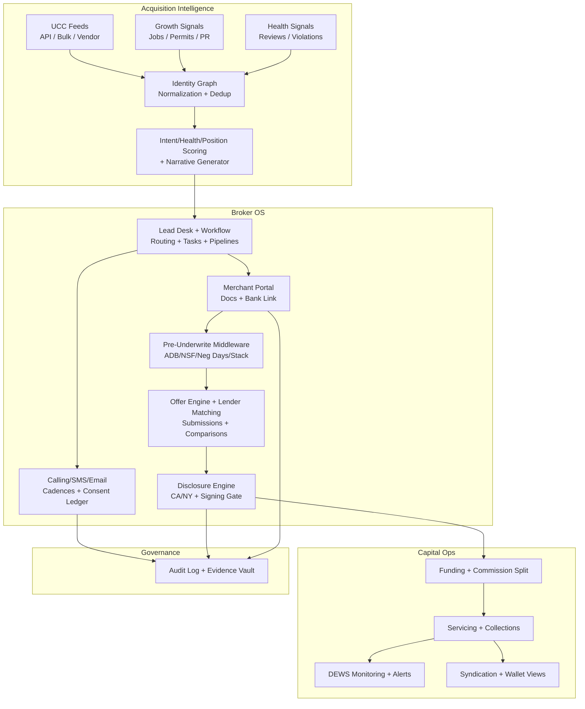

# Synthesis of Attached MCA Research into a Unified Super-Suite Application

## Ingested research and unified thesis

Across the attached documents, a consistent picture emerges: MCA is a **high-velocity acquisition + underwriting + operations system**, where competitive advantage comes from (a) sourcing the right merchants at the right moment, (b) converting them faster than competitors, (c) pricing/structuring risk with better signals than “last quarter’s bank statements,” and (d) surviving in an increasingly adversarial compliance environment.

The lead-generation research is explicit that “lead quality” in MCA is not one-dimensional. It is a vector composed of **intent**, **health**, and **position** (stack depth), each of which changes both conversion probability and funding feasibility. Intent captures whether a merchant is actively seeking funding (e.g., recent UCC activity), health reflects whether the business can sustain daily remittances (e.g., revenue/bank balance minimums), and position reflects the number of existing advances—where first position is most desirable and heavily stacked positions are often toxic. [MCA Lead Generation_ Costs, Conversions, Alternatives.md L26-L36]

The UCC-focused specs and expansion designs propose a wedge that is unusually defensible in a market saturated with “same leads, same dialer, same scripts”: build proprietary **public-record intelligence** that can algorithmically surface “whale” opportunities. The core thesis is to identify businesses that (1) had a **default “years and years ago,”** (2) are still **Active** today, and (3) have a default old enough to fall outside many funders’ typical lookback windows (often framed as the “last 1–3 years”). [UCC-MCA-DataScrapper.docx L24-L32] This is formalized further as a simple but powerful decision rule for prospect generation: `Company_Status = Active` AND `Historical_UCC_Default_Date > 3 years ago` AND `Recent_UCC_Filings = 0 or low`. [UCC-MCA-DataScrapper.docx L37-L45]

The platform landscape research extends this into a broader operating reality: the MCA tech market is “mid-consolidation,” with many CRMs and LOS/servicing systems that cover large swaths of workflow, but still leave critical gaps around **UCC intelligence**, **bank-statement-derived underwriting middleware**, **portfolio monitoring**, and **compliance-as-code gates**. [MCA Platform Research and Growth Strategy.md L13-L23] That same document identifies a common failure mode for bespoke builds: “schema drift” and architectural dissonance—fatal in finance because data consistency is not optional. [MCA Platform Research and Growth Strategy.md L13-L23]

**Unified thesis for the super-suite:** build an MCA “operating system” that treats public records (UCC + related signals) as a first-class input to broker/funder workflows, and unifies:  
**System of Record (identity + deals + disclosures + comms)** → **System of Decision (scoring + lender matching + underwriting rules)** → **System of Action (routing + outreach + submissions + servicing + monitoring)**.

## Super-suite product blueprint

The attached research can be synthesized into a single product family: an **MCA Super-Suite** with three tightly coupled surfaces (each can be sold as an edition, but architected as one platform).

**Intelligence Studio (Lead + Market Intelligence):** continuously ingests UCC/public record activity, enriches companies with growth and health signals, deduplicates identities, and generates prioritized “stories” for outreach (e.g., “Defaulted on Lender X in 2018; still Active; growth signals detected; likely refinance/buyout candidate”). This matches the lead handoff requirement that each lead include company name, a concise “story,” and appended contact data for the sales call. [UCC-MCA-DataScrapper.docx L30-L36]

**Broker OS (CRM + Deal Desk + Compliance):** manages lead lifecycle, communications, “pack” collection, submissions to lenders, offer comparison, workflow gating for disclosures, e-sign, commissions, and renewal/recycle loops. It directly addresses the funnel mechanics described in the lead economics research: contact → submission (“pack”) → approval → take-rate. [MCA Lead Generation_ Costs, Conversions, Alternatives.md L195-L207]

**Capital Ops (Funder/Servicer + Syndication + Portfolio Monitoring):** (optional but strategically important) supports automated collections, syndication allocations, performance dashboards, and early warning alerts—leveraging the “Default Early Warning System (DEWS)” concept from the expansion design. [mca-datascrap-softwaresolutions+expansion.txt L53-L61]

A practical way to express the combined suite is by lifecycle coverage:

| MCA lifecycle stage  | Super-suite module                             | Primary outputs                                                |
| -------------------- | ---------------------------------------------- | -------------------------------------------------------------- |
| Sourcing             | UCC/Public Record Ingestion + Lead Marketplace | New leads, stack/position signals, competitor activity, alerts |
| Qualification        | Pre-underwrite & Scoring                       | Health metrics, risk flags, “fit” scores, routing decisions    |
| Outreach             | Communications + Consent + Cadences            | Call/SMS/email sequences, contact attempts, compliance proofs  |
| Submission           | Pack & Document Workflow                       | Statement capture, checklist progress, automated extraction    |
| Pricing/Offers       | Offer Engine + Lender Matching                 | Comparable offers, term/factor models, constraints validation  |
| Disclosure & Closing | Disclosure Engine + eSign                      | State-required disclosures + acknowledgments, signed contracts |
| Funding & Servicing  | Collections + Exceptions + Renewals            | ACH runs, retries, NSF handling, renewals, servicing notes     |
| Portfolio risk       | Monitoring + DEWS                              | Risk trend dashboards, alerts, intervention workflows          |
| Analytics            | BI + Attribution                               | CPL→CAC, rep performance, lender conversion, ROI by channel    |

## Data and intelligence layer design

### UCC acquisition strategy by state reality

The research is clear that **state-by-state variance** is not an edge case—it is the norm. Postures range from modern APIs to privatized registries and bulk data programs. [MCA Platform Research and Growth Strategy.md L100-L108]

A production-grade suite should not rely on a single technique (“just scrape the DOM everywhere”). Instead, implement a **State Data Access Policy** with a priority order: official API → official bulk feeds → contracted vendor feeds → automation where permitted.

Concrete examples supported by authoritative state sources:

Florida’s Department of State explicitly notes that the UCC filing process was **privatized to Image API, LLC** and directs users to the Florida Secured Transaction Registry. citeturn13search0 This supports the platform research conclusion that Florida is best approached as a **commercial data relationship** rather than aggressive UI automation. [MCA Platform Research and Growth Strategy.md L100-L108]

Texas’ Secretary of State describes a **bulk order** program for UCC data, including “Master Unload” snapshots and “Daily Filing Update” products; it also documents pricing and that files can be downloaded via their SOS Portal. citeturn13search2turn13search1 This directly enables scalable ingestion without brittle scraping.

California maintains an official **API Management Portal** for CA SOS open data, including UCC-oriented API products and implementation guides. citeturn13search3turn13search6 This validates the platform research recommendation to use structured API access where available.

### The identity graph as the core “data moat”

All documents implicitly depend on one hard truth: UCC debtor names are messy. A super-suite must treat **entity resolution** as a first-class module, not a cleanup afterthought.

Minimum capabilities:

- Normalization: legal suffix stripping, punctuation folding, DBA aliasing, address standardization.
- Survivorship: merge rules for conflicting fields (phone/email/address).
- Evidence ledger: store “why” merges were performed (sources + timestamps), because downstream compliance and underwriting decisions depend on traceability.

This identity layer unlocks higher-order ML and analytics: stack position estimation, renewal eligibility timing, competitor exposure, and portfolio monitoring.

### Signal fusion: from “UCC-only” to “multi-signal lead narratives”

The expansion design proposes three major non-UCC signal classes that should be fused into scoring and narratives:

Growth signals: job postings, permits, contract awards; stored as structured “Growth_Signals” and rolled into lead narratives and scoring. [mca-datascrap-softwaresolutions+expansion.txt L10-L18]

Health score signals: reviews/sentiment and violations; produce a letter grade (A–F) and trend deltas; reused as a **portfolio early warning** engine (DEWS). [mca-datascrap-softwaresolutions+expansion.txt L53-L61]

Competitor intelligence: aggregate UCC secured party activity into market-level insights and dashboards (top funders, trends by industry/state). [mca-datascrap-softwaresolutions+expansion.txt L53-L61]

These complement the lead-quality triad (intent/health/position). For example, “intent” can be UCC recency; “position” can be inferred from recent filing volume/secured parties; and “health” can be approximated with real-time reputation/violation signals before bank statements arrive. [MCA Lead Generation_ Costs, Conversions, Alternatives.md L26-L36]

### Underwriting middleware: bank data + rules engine, not just storage

The lead economics research emphasizes that underwriters—and therefore brokers doing “pre-underwriting”—rely on bank statement-derived metrics like **Average Daily Balance (ADB)**, **NSFs**, and **negative days**. [MCA Lead Generation_ Costs, Conversions, Alternatives.md L234-L253] In parallel, the platform landscape research argues that automated parsing and “smart filtering” (rules engines and lender buy boxes) will be a defining differentiator. [MCA Platform Research and Growth Strategy.md L155-L165]

A modern integration approach is to plug in bank-data and statement analytics vendors rather than reinventing parsing from scratch:

- **Plaid Transactions** supports retrieving and refreshing up to **24 months** of transaction data via its Transactions endpoints, with configurable “days requested” up to a maximum of **730 days**. citeturn8search3turn8search1
- **DecisionLogic** positions itself as providing real-time verification plus up to **365 days** of transaction history along with “advanced analytics.” citeturn7search3turn7search8
- **Ocrolus** documents lender analytics including indicators like NSFs, negative balances, and ADB-type metrics; its bank statement income analysis tooling highlights NSF/overdraft and missing statement flags as part of the workflow. citeturn7search4turn7search6turn7search7

The super-suite should implement an internal **Underwriting Feature Store** that standardizes outputs from these providers into a canonical schema (deposits, withdrawals, daily balances, NSF events, lender payment detection, etc.), enabling consistent rules and auditable decisions regardless of upstream vendor.

## Brokerage operating workflows and economics

### Funnel-aligned workflow design

The lead economics document provides a concrete conversion funnel: contact rate → submission rate (pack) → approval rate → take rate, with benchmark ranges for each. [MCA Lead Generation_ Costs, Conversions, Alternatives.md L195-L207] The super-suite should therefore orient the UI/automation around maximizing throughput at the **highest-leverage bottlenecks**:

Speed-to-lead for high-intent channels: the same document notes UCC-driven merchants can be called by dozens of brokers rapidly, and saturation drives contact rates down; the operational edge becomes who reaches the merchant first with the most credible story. [MCA Lead Generation_ Costs, Conversions, Alternatives.md L57-L69]

Pack capture acceleration: submission rates hinge on getting bank statements quickly; therefore the platform needs: frictionless merchant portal, “upload by link,” automated reminders, and real-time pack completeness tracking.

Lender matching and shotgun suppression: reduce waste by matching to lender buy boxes and rejecting deals that violate threshold criteria before submission; products like LoanWorx explicitly market auto-reject based on NSF days and minimums, plus dashboards showing “loan positions” and “daily balances,” illustrating market demand for underwriting middleware. citeturn7search0turn7search2

### Lead channel economics as a built-in attribution engine

The lead economics research gives explicit cost-per-lead (CPL) tiers across channels: live transfers ($30–$100+), real-time web leads ($15–$40), fresh UCC leads (~$0.15–$0.40), and various aged lead tiers down to pennies. [MCA Lead Generation_ Costs, Conversions, Alternatives.md L176-L186]

This means any serious broker platform must ship with a **unit economics cockpit**:

- CPL and CAC by channel/vendor
- labor cost overlays (dials/hr, connects/hr)
- conversion by rep and by funnel stage
- “time-to-contact” distributions for each lead source

The output should be actionable operational policy: which sources to scale, which leads to recycle, which require better compliance controls, and which are pure margin traps.

### The “old default whale” motion as a differentiated playbook

The UCC-MCA spec is explicit that the system is meant to replicate a competitor’s “whale” deal and focuses on old defaults overlooked by typical underwriting history windows. [UCC-MCA-DataScrapper.docx L3-L11] To operationalize this, the super-suite should provide a specialized “Whale Desk” workflow:

- Automated discovery: default older than threshold + active status verification. [UCC-MCA-DataScrapper.docx L37-L45]
- Narrative generation: a broker-ready story explaining why the merchant is a target now.
- Deal strategy presets: refinance/buyout vs add-on, plus stack position heuristics from UCC cadence.
- “Quiet outreach” modes: lower-volume, higher-craft sequences to avoid the UCC saturation dynamic.

## Compliance, security, and governance requirements

The attached research devotes substantial attention to compliance because brokerage growth can be destroyed by enforcement, private litigation, or vicarious liability exposure.

### Telemarketing and contact compliance as product features

FTC guidance on TSR compliance and DNC provisions is unambiguous: calling consumers who have requested not to be called can trigger civil penalties of up to **$53,088 per violation**, and TSR compliance expects sellers/telemarketers to access the registry and update call lists at least every 31 days. citeturn1search0turn0search4turn0search4turn1search1

Separately, TCPA provides a private right of action allowing recovery of **$500 per violation**, with the court able to treble damages up to **3×** for “willful or knowing” violations. citeturn2search0

The lead-gen research also highlights vicarious liability dynamics: the buyer of leads can be pulled into liability for abusive or deceptive tactics undertaken by lead generators. [MCA Lead Generation_ Costs, Conversions, Alternatives.md L164-L174]

**Implication:** compliance cannot be “training + policy PDF.” It has to be implemented as **workflow gates + evidence systems**:

- Consent and suppression ledger (per phone number, per channel, per jurisdiction)
- National DNC subscription management and automated suppression
- Proof artifacts: “why this contact was permitted” (consent, EBR, exemption)
- Vendor attribution: every lead and every contact attempt must be linked to a vendor/source contract and representation
- Immutable audit logs: edits, exports, contact attempts, disclosure presentations

### Commercial financing disclosures as workflow gates

California’s DFPI explains that SB 1235 requires disclosure delivery at the time a provider extends a specific offer of commercial financing, and that the recipient must sign disclosures before the provider may finalize the transaction; it also enumerates required disclosure elements (total funds, dollar cost, term/estimated term, payment method/frequency/amount, prepayment policies, and (until Jan 1, 2024) annualized rate). citeturn0search2

New York’s Department of Financial Services announced adoption of a regulation implementing New York’s Commercial Finance Disclosure Law (CFDL). citeturn0search0

The platform research frames this as “compliance as code”: dynamic disclosure engines and workflow blocking until disclosures have been presented and acknowledged. [MCA Platform Research and Growth Strategy.md L155-L165]

**Super-suite requirement:** a versioned disclosure engine, keyed by state + product type + offer parameters, with mandatory acknowledgment capture and immutable retention.

### Ethical scraping, data privacy, and the “allowed access” doctrine

The expansion design repeatedly emphasizes respecting robots.txt, rate limits, and privacy boundaries in scraping agents, and recommends avoiding targeting individuals and focusing on publicly available business data. [mca-datascrap-softwaresolutions+expansion.txt L10-L18] It explicitly treats ethics and legal compliance as design constraints, not afterthoughts. [mca-datascrap-softwaresolutions+expansion.txt L124-L132]

For a broker-grade system, also add:

- data minimization (collect only what is necessary for underwriting/operations)
- encryption at rest + field-level encryption for sensitive identifiers
- strict RBAC and tenant boundary enforcement
- export controls (who can export lead lists; watermarking and logging)
- retention policies aligned to business need + regulatory posture

## Competitive landscape, gaps, and differentiation strategy

### Competitive analysis table

Below is a comparative snapshot of several commonly referenced MCA platforms, plus a newer underwriting automation entrant. Pricing is included only where publicly stated on vendor pages or widely used pricing sources.

| Platform                                        | Strength claim / notable features (public)                                                                                                                                                                                                                                             | Public pricing visibility                                                                                                                               | Gaps the super-suite can exploit                                                                                                                                                                                                                                                         |
| ----------------------------------------------- | -------------------------------------------------------------------------------------------------------------------------------------------------------------------------------------------------------------------------------------------------------------------------------------- | ------------------------------------------------------------------------------------------------------------------------------------------------------- | ---------------------------------------------------------------------------------------------------------------------------------------------------------------------------------------------------------------------------------------------------------------------------------------- |
| MCA Suite                                       | Positions as MCA CRM covering deal tracking, lead management, submission tracking, commission tracking, portals, syndication, document storage, and integrations/APIs. citeturn4search0turn4search3                                                                                | Pricing not public on main product page. citeturn4search0                                                                                            | Strong ops breadth, but “UCC intelligence + multi-signal lead scoring” is not its core differentiator; opportunity to lead with proprietary public-record intelligence + automated compliance evidence. citeturn4search0                                                              |
| Centrex                                         | Markets pipeline management, lender submissions, commission tracking, and customer portal; emphasizes broker/funder/syndicate roles. citeturn3search4                                                                                                                               | Pricing not clearly published for core CRM; billing policy page describes user-login-based billing but not unit price. citeturn5search2turn3search4 | Differentiation opportunity: deeper public record ingestion and auditable compliance gates; stronger underwriting middleware and identity graph. citeturn3search4                                                                                                                     |
| Ricochet360                                     | CRM + calling stack with published per-seat plans and features (telephony, SMS, automation, caller ID masking, etc.). citeturn3search2turn3search0                                                                                                                                 | Yes: e.g., $20/$35/$85/$125/$165 per user/month (varies by plan and billing cycle). citeturn3search2                                                 | Strong dialer-centric value; gap is proprietary lead intelligence and disclosure/consent evidence systems tied to offer workflows. citeturn3search2                                                                                                                                   |
| LendSaaS                                        | Positions as end-to-end MCA origination & servicing, including automated collections, automated syndication “wallets,” underwriting processes, bank statement parsing, docs/contracts/eSign. citeturn4search1                                                                       | Not public (“schedule/demo”). citeturn4search1                                                                                                       | Opportunity: broker-first intelligence and lead economics tooling; tighter integration of public-record sourcing into underwriting and renewals. citeturn4search1                                                                                                                     |
| LoanWorx                                        | Markets pre-funding workflow: automated intake from email, bank statement extraction, smart filtering (e.g., NSF days), underwriter dashboards with positions/daily balances, offer calculators, and integrations with existing systems. citeturn7search0turn7search2turn4search6 | Pricing not public on cited pages. citeturn7search0                                                                                                  | Strong underwriting middleware; gap is end-to-end lead sourcing intelligence and broker CRM + compliance evidence out of the box. citeturn7search2                                                                                                                                    |
| Cloudsquare Broker (Salesforce-based ecosystem) | Often positioned as MCA broker CRM on Salesforce with lender API integrations reported in industry coverage. citeturn6search2turn6search5                                                                                                                                          | G2 lists “Broker $95.00 / user / month” (vendor-provided). citeturn5search1                                                                          | Salesforce-based systems can be powerful but costly/complex; the differentiation opportunity is a purpose-built suite where public-record intelligence + compliance gating is native, not custom. Salesforce licensing costs may also apply separately. citeturn4search2turn5search1 |

### Market gaps surfaced by combining the research

When you stitch the attached research together, the most actionable gaps are not “yet another MCA CRM.” They are structural:

**UCC and public-record intelligence as a primary moat:** Most platforms manage leads; fewer **originate superior leads** through real-time UCC/public record intelligence fused with growth/health signals. The Florida/Texas/California access realities suggest that building a reliable multi-state ingestion layer is itself a barrier to entry. citeturn13search0turn13search2turn13search3

**Compliance evidence systems, not compliance slogans:** With TSR penalties described by the FTC and TCPA statutory damages, brokerages need systems that can prove suppression, consent, and disclosure acknowledgments at scale. citeturn1search0turn2search0turn0search2

**Underwriting middleware that brokers can use before submission:** The lead-gen research shows the “pack” and bank metrics are central; the market shows demand for tools that compute NSF/negative days, positions, balance trends, and reject non-fit automatically. [MCA Lead Generation_ Costs, Conversions, Alternatives.md L234-L253] citeturn7search2turn7search1

**Unit economics as a first-class dashboard:** Because CPL differs by orders of magnitude across channels (pennies to $100+), the system must compute ROI per channel/vendor and incorporate labor impact—not just store leads. [MCA Lead Generation_ Costs, Conversions, Alternatives.md L176-L186]

### Recommended phased build path

The expansion design provides a pragmatic phased roadmap (core prototype → multi-state expansion → growth/health → portfolio monitoring/market intel → ML → lead recycling), which aligns well with the super-suite’s staged commercialization. [mca-datascrap-softwaresolutions+expansion.txt L129-L141]

A combined “super-suite” roadmap that respects both engineering reality and go-to-market urgency:

- **Foundation release:** canonical schema + identity graph + ingestion pipeline + broker-facing lead desk (already aligned with the “handoff story” spec). [UCC-MCA-DataScrapper.docx L30-L36]
- **Intelligence release:** multi-state UCC ingestion using official feeds where possible (TX bulk JSON; CA SOS API; FL vendor feed), plus growth/health signals and narrative scoring. citeturn13search2turn13search6turn13search0
- **Broker OS release:** communications + consent ledger + pack portal + lender matching and submission workflows, wired to funnel analytics. [MCA Lead Generation_ Costs, Conversions, Alternatives.md L195-L207]
- **Compliance release:** disclosure engine for CA and NY (then other states), with workflow gating, signed acknowledgments, and audit-grade logs. citeturn0search2turn0search0
- **Capital Ops release:** servicing, syndication support, and DEWS alerts for funded portfolios. [mca-datascrap-softwaresolutions+expansion.txt L53-L61]
- **ML augmentation:** once labeled outcomes exist, introduce predictive scoring that improves prospect selection, recycle timing, and exception handling over time. [mca-datascrap-softwaresolutions+expansion.txt L129-L141]



---

```markdown
---
name: evaluation-to-growth
description: Systematic content evaluation framework progressing through Critique → Reinforcement → Risk Analysis → Growth. Use when reviewing writing, arguments, proposals, code documentation, or any content requiring rigorous multi-dimensional assessment. Supports interactive guided mode or autonomous full-report mode, with output as markdown report, structured checklist, or inline revision suggestions. Triggers on requests to evaluate, critique, improve, strengthen, or review content quality.
---

# Evaluation to Growth

## Mode Selection

**Execution Mode:** Autonomous Mode  
**Output Format:** Markdown Report

## The Framework

[Evaluation] → [Reinforcement] → [Risk Analysis] → [Growth]

## Evaluation Phase

### Critique

**Strengths (with specific examples)**

- Strong wedge clarity: the combined proposal leverages a defensible “public-record intelligence” moat rather than competing as a generic MCA CRM.
- Workflow realism: the design aligns to actual funnel stages (contact → pack → approval → take-rate) rather than abstract “CRM features.”
- Modular expansion path: staged releases support early monetization through Intelligence Studio before building full servicing.

**Weaknesses (with specific examples)**

- Scope risk: the “super-suite” includes lead gen, underwriting middleware, disclosures, communications, servicing, and syndication—each is a product category on its own.
- Data rights ambiguity: some sources (job boards, review sites) may restrict automated extraction; “allowed access” policies must be codified per source.
- Operational detail gaps: lender matching requires a maintained “buy box” dataset and continuous update operations, which can become a major hidden cost.

**Priority areas (ranked)**

1. Define the canonical system-of-record schema and tenant/RBAC model.
2. Codify a Data Access Policy (API/bulk/vendor/scrape-permitted) per jurisdiction/source.
3. Narrow MVP to the smallest closed loop that proves ROI: (UCC + identity + narrative scoring + outreach routing + unit economics).
4. Add compliance evidence (consent + disclosures + audit) before scaling outbound.

### Logic Check

**Contradictions found**

- “Ethical scraping” is emphasized while also expanding to sources commonly protected by ToS (e.g., certain job boards or review platforms). This must be resolved via approved APIs, partnerships, or strict allowed-use policies.

**Reasoning gaps**

- Assumes “old default whales” are consistently fundable; in practice, funding depends on current cash flow and merchant stability. The proposal must explicitly require bank-data confirmation before advancing in the workflow.

**Unsupported claims**

- Any implied certainty that public sentiment or review trends directly predict repayment without validation data. This should be framed as a heuristic until outcomes validate it.

**Coherence recommendations**

- Add an explicit “decision checkpoint” architecture: Intelligence signals → Pack capture → Underwriting confirmation → Offer/disclosure gating.
- Define required evidence artifacts at each checkpoint (e.g., consent proof before outreach automation at scale).

### Logos Review

**Argument clarity**

- High: the proposal states clear differentiation and explains how modules map to lifecycle stages.

**Evidence quality**

- Medium: grounded in provided research and known regulatory constraints, but operational performance claims (“better conversion”) need measurement plans.

**Persuasive strength**

- Strong for leadership: it frames the suite as an operating system with a defensible data layer.

**Enhancement recommendations**

- Add KPI definitions and telemetry requirements: time-to-contact, pack completion rate, lender approval probability calibration, and compliance exception rate.

### Pathos Review

**Current emotional tone**

- Professional, strategic, “operator-focused.”

**Audience connection**

- Strong for brokerage leadership; moderate for engineering teams who need more specific acceptance criteria.

**Engagement level**

- High, especially around the “moat” narrative and market gaps.

**Recommendations**

- Include 2–3 “day in the life” vignettes: junior agent, senior closer, compliance manager.

### Ethos Review

**Perceived expertise**

- Strong: reflects understanding of MCA cadence, stack dynamics, underwriting, and compliance.

**Trustworthiness signals present/missing**

- Present: explicit compliance gating and evidence systems.
- Missing: explicit statements of uncertainty where outcomes data is not yet available (e.g., ML claims, sentiment scoring accuracy).

**Authority markers**

- Strong: references official regimes (TSR/TCPA/disclosures) and positions compliance as a moat.

**Credibility recommendations**

- Add a “validation plan” section: pilot cohorts, A/B tests (rule-based vs ML), and post-mortems on false positives.

## Reinforcement Phase

### Synthesis

- Resolve the “scrape vs ToS” tension by defining a per-source compliance method: official APIs, licensed data feeds, or exclusion.
- Insert underwriting confirmation gates so that “whale” identification never skips cash-flow validation.
- Tighten MVP:
  - MUST: UCC ingestion (few states), identity graph, narrative scoring, lead routing, unit economics dashboard, consent ledger.
  - SHOULD: pack portal + bank link.
  - LATER: servicing, syndication, ML.

## Risk Analysis Phase

### Blind Spots

**Hidden assumptions**

- Assumes consistent access to public-record data at scale without cost spikes.
- Assumes broker teams will adopt structured workflows vs ad hoc “dial and note.”

**Overlooked perspectives**

- Lenders: they may reject “smart submissions” if the platform sends inconsistent data.
- Vendors: lead providers may resist transparent attribution that reveals poor performance.

**Potential biases**

- Overweights data signals and underweights salescraft and relationship dynamics.

**Mitigation strategies**

- Negotiate explicit data agreements early for key states/sources.
- Build change-management features: gamification, coaching dashboards, and workflow nudges.
- Create lender-facing submission quality dashboards to improve trust.

### Shatter Points

**Critical vulnerabilities (severity)**

- High: compliance failure in outreach at scale (TSR/TCPA or disclosure violations).
- High: identity resolution errors causing wrong-party contact or duplicate hammering.
- Medium: ingestion brittleness or data feed interruptions impacting lead freshness.

**Potential attack vectors**

- Plaintiffs alleging lack of consent / failure to scrub DNC.
- Regulators alleging inadequate disclosures or deceptive practices.
- Competitors challenging data acquisition methods or reliability.

**Preventive measures**

- Default-deny automation: outbound sequences only after consent rules satisfied.
- Immutable audit logging and evidence vault.
- Strong SRE practices: monitoring, failover, and ingestion health SLAs.

**Contingency preparations**

- “Kill switch” for outbound automation if compliance anomalies detected.
- Rapid rollback and incident response runbooks.

## Growth Phase

### Bloom

**Emergent themes**

- “Compliance evidence” can be a marketable differentiator, not just risk control.
- “Underwriting middleware” is a standalone product category that can integrate into existing CRMs (bridging to partnerships).

**Expansion opportunities**

- Offer “UCC Intelligence as a Service” to CRMs and lenders via API (data + scoring).
- Provide lead vendor scoring and automated dispute workflows.

**Novel angles**

- Create a “stack position marketplace” view: merchants’ inferred positions and refinance opportunities by time window.

**Cross-domain connections**

- Apply fraud tooling patterns from lending (document tamper detection, anomaly detection) to broker submissions and pack integrity.

### Evolve

**Revision summary**

- Reduced MVP scope to the smallest closed loop that proves ROI while embedding compliance-by-design.
- Added explicit decision checkpoints and evidence artifacts.

**Strength improvements**

- Before: broad suite could feel like “boil the ocean.”
- After: phased architecture with clear MVP boundaries makes execution credible.

**Risk mitigations applied**

- Data access policy, consent gating, audit logging, and kill switches added as explicit requirements.

**Final product (revised content)**

- A phased super-suite: start with UCC + identity + narrative scoring + compliant outreach routing + unit economics; add pack + underwriting middleware; then disclosure engine; then servicing/syndication; finally ML optimization once outcomes data exists.
```
