# Database Schema Documentation

## Overview

The UCC-MCA Intelligence Platform uses PostgreSQL 14+ with the following extensions:

- `uuid-ossp` - UUID generation
- `pg_trgm` - Fuzzy text search (trigram matching)
- `btree_gin` - Composite indexes for better query performance

## Entity Relationship Diagram

```mermaid
erDiagram
    UCC_FILINGS ||--o{ PROSPECT_UCC_FILINGS : "linked to"
    PROSPECTS ||--o{ PROSPECT_UCC_FILINGS : "has"
    PROSPECTS ||--o{ GROWTH_SIGNALS : "has"
    PROSPECTS ||--o{ HEALTH_SCORES : "has"
    PROSPECTS ||--o{ ENRICHMENT_LOGS : "tracks"
    PORTFOLIO_COMPANIES ||--o{ PORTFOLIO_HEALTH_SCORES : "has"
    HEALTH_SCORES ||--o{ PORTFOLIO_HEALTH_SCORES : "linked to"

    UCC_FILINGS {
        uuid id PK
        varchar external_id UK
        date filing_date
        varchar debtor_name
        varchar secured_party
        char state
        decimal lien_amount
        varchar status
        varchar filing_type
        varchar source
        jsonb raw_data
        timestamp created_at
        timestamp updated_at
    }

    PROSPECTS {
        uuid id PK
        varchar company_name
        varchar industry
        char state
        varchar status
        integer priority_score
        date default_date
        integer time_since_default
        date last_filing_date
        text narrative
        decimal estimated_revenue
        varchar claimed_by
        date claimed_date
        timestamp last_enriched_at
        decimal enrichment_confidence
    }

    GROWTH_SIGNALS {
        uuid id PK
        uuid prospect_id FK
        varchar type
        text description
        date detected_date
        text source_url
        integer score
        decimal confidence
        jsonb raw_data
    }

    HEALTH_SCORES {
        uuid id PK
        uuid prospect_id FK
        char grade
        integer score
        varchar sentiment_trend
        integer review_count
        decimal avg_sentiment
        integer violation_count
        date recorded_date
        jsonb raw_data
    }

    COMPETITORS {
        uuid id PK
        varchar lender_name UK
        integer filing_count
        decimal avg_deal_size
        decimal market_share
        array industries
        char top_state
        decimal monthly_trend
    }

    PORTFOLIO_COMPANIES {
        uuid id PK
        varchar company_name
        date funding_date
        decimal funding_amount
        varchar current_status
        date last_alert_date
    }

    INGESTION_LOGS {
        uuid id PK
        varchar source
        varchar status
        integer records_found
        integer records_processed
        jsonb errors
        integer processing_time_ms
        timestamp started_at
        timestamp completed_at
    }

    ENRICHMENT_LOGS {
        uuid id PK
        uuid prospect_id FK
        varchar status
        array enriched_fields
        jsonb errors
        decimal confidence
        integer processing_time_ms
    }
```



## Tables

### Core Business Tables

#### `ucc_filings`

Stores UCC (Uniform Commercial Code) filing records from state portals.

| Column                     | Type          | Constraints                    | Description                              |
| -------------------------- | ------------- | ------------------------------ | ---------------------------------------- |
| `id`                       | UUID          | PK, DEFAULT uuid_generate_v4() | Primary key                              |
| `external_id`              | VARCHAR(255)  | UNIQUE, NOT NULL               | Original filing ID from source           |
| `filing_date`              | DATE          | NOT NULL, <= CURRENT_DATE      | Date the filing was recorded             |
| `debtor_name`              | VARCHAR(500)  | NOT NULL                       | Name of the debtor                       |
| `debtor_name_normalized`   | VARCHAR(500)  | NOT NULL                       | Lowercased, trimmed for search           |
| `secured_party`            | VARCHAR(500)  | NOT NULL                       | Name of the secured party (lender)       |
| `secured_party_normalized` | VARCHAR(500)  | NOT NULL                       | Lowercased, trimmed for search           |
| `state`                    | CHAR(2)       | NOT NULL                       | Two-letter state code                    |
| `lien_amount`              | DECIMAL(15,2) | NULL                           | Dollar amount of the lien                |
| `status`                   | VARCHAR(20)   | NOT NULL                       | One of: 'active', 'terminated', 'lapsed' |
| `filing_type`              | VARCHAR(10)   | NOT NULL                       | One of: 'UCC-1', 'UCC-3'                 |
| `source`                   | VARCHAR(100)  | NOT NULL                       | Data source (e.g., 'ny-portal', 'api')   |
| `raw_data`                 | JSONB         | NULL                           | Original data for reference              |
| `created_at`               | TIMESTAMPTZ   | DEFAULT NOW()                  | Record creation timestamp                |
| `updated_at`               | TIMESTAMPTZ   | DEFAULT NOW()                  | Last update timestamp                    |

**Indexes:**

- `idx_ucc_filing_date` - Filing date (DESC) for date range queries
- `idx_ucc_debtor_name` - GIN trigram index for fuzzy search
- `idx_ucc_secured_party` - GIN trigram index for fuzzy search
- `idx_ucc_state` - State filter
- `idx_ucc_status` - Status filter
- `idx_ucc_lapsed` - Partial index for lapsed filings

---

#### `prospects`

Central table for MCA prospect leads derived from UCC filings.

| Column                    | Type          | Constraints             | Description                                                                                             |
| ------------------------- | ------------- | ----------------------- | ------------------------------------------------------------------------------------------------------- |
| `id`                      | UUID          | PK                      | Primary key                                                                                             |
| `company_name`            | VARCHAR(500)  | NOT NULL                | Company/debtor name                                                                                     |
| `company_name_normalized` | VARCHAR(500)  | NOT NULL                | Normalized for search                                                                                   |
| `industry`                | VARCHAR(50)   | NOT NULL                | One of: 'restaurant', 'retail', 'construction', 'healthcare', 'manufacturing', 'services', 'technology' |
| `state`                   | CHAR(2)       | NOT NULL                | Two-letter state code                                                                                   |
| `status`                  | VARCHAR(20)   | NOT NULL, DEFAULT 'new' | One of: 'new', 'claimed', 'contacted', 'qualified', 'dead'                                              |
| `priority_score`          | INTEGER       | NOT NULL, 0-100         | ML-generated priority score                                                                             |
| `default_date`            | DATE          | NOT NULL                | Date of default event                                                                                   |
| `time_since_default`      | INTEGER       | NOT NULL, >= 0          | Days since default (auto-calculated)                                                                    |
| `last_filing_date`        | DATE          | NULL                    | Most recent UCC filing date                                                                             |
| `narrative`               | TEXT          | NULL                    | Generated prospect narrative                                                                            |
| `estimated_revenue`       | DECIMAL(15,2) | NULL                    | Estimated annual revenue                                                                                |
| `claimed_by`              | VARCHAR(200)  | NULL                    | User who claimed this prospect                                                                          |
| `claimed_date`            | DATE          | NULL                    | Date prospect was claimed                                                                               |
| `last_enriched_at`        | TIMESTAMPTZ   | NULL                    | Last enrichment timestamp                                                                               |
| `enrichment_confidence`   | DECIMAL(3,2)  | NULL                    | Confidence score 0.00-1.00                                                                              |

**Indexes:**

- `idx_prospects_priority` - Priority score (DESC) for sorting
- `idx_prospects_industry` - Industry filter
- `idx_prospects_state` - State filter
- `idx_prospects_status` - Status filter
- `idx_prospects_company_name` - GIN trigram for fuzzy search
- `idx_prospects_default_date` - Default date (DESC)
- `idx_prospects_claimed` - Partial index for claimed prospects

---

#### `growth_signals`

Positive indicators suggesting business growth potential.

| Column          | Type         | Constraints     | Description                                                      |
| --------------- | ------------ | --------------- | ---------------------------------------------------------------- |
| `id`            | UUID         | PK              | Primary key                                                      |
| `prospect_id`   | UUID         | FK -> prospects | Associated prospect                                              |
| `type`          | VARCHAR(20)  | NOT NULL        | One of: 'hiring', 'permit', 'contract', 'expansion', 'equipment' |
| `description`   | TEXT         | NOT NULL        | Human-readable description                                       |
| `detected_date` | DATE         | NOT NULL        | When signal was detected                                         |
| `source_url`    | TEXT         | NULL            | URL source of the signal                                         |
| `score`         | INTEGER      | NOT NULL, 0-100 | Signal strength score                                            |
| `confidence`    | DECIMAL(3,2) | NOT NULL, 0-1   | Detection confidence                                             |
| `raw_data`      | JSONB        | NULL            | Original signal data                                             |

**Signal Types:**

- `hiring` - Job postings, hiring announcements
- `permit` - Building permits, expansion permits
- `contract` - Government contracts, large orders
- `expansion` - New locations, market expansion
- `equipment` - Equipment purchases, upgrades

---

#### `health_scores`

Time-series health metrics for prospects.

| Column            | Type         | Constraints     | Description                                |
| ----------------- | ------------ | --------------- | ------------------------------------------ |
| `id`              | UUID         | PK              | Primary key                                |
| `prospect_id`     | UUID         | FK -> prospects | Associated prospect                        |
| `grade`           | CHAR(1)      | NOT NULL        | One of: 'A', 'B', 'C', 'D', 'F'            |
| `score`           | INTEGER      | NOT NULL, 0-100 | Numeric health score                       |
| `sentiment_trend` | VARCHAR(20)  | NOT NULL        | One of: 'improving', 'stable', 'declining' |
| `review_count`    | INTEGER      | NOT NULL, >= 0  | Number of reviews analyzed                 |
| `avg_sentiment`   | DECIMAL(3,2) | NOT NULL, 0-1   | Average sentiment score                    |
| `violation_count` | INTEGER      | NOT NULL, >= 0  | Number of violations                       |
| `recorded_date`   | DATE         | NOT NULL        | Date score was recorded                    |
| `raw_data`        | JSONB        | NULL            | Detailed health metrics                    |

**Unique Constraint:** One score per prospect per day (`prospect_id`, `recorded_date`)

---

#### `competitors`

Aggregated competitor (lender) analysis data.

| Column                   | Type          | Constraints         | Description                |
| ------------------------ | ------------- | ------------------- | -------------------------- |
| `id`                     | UUID          | PK                  | Primary key                |
| `lender_name`            | VARCHAR(500)  | UNIQUE, NOT NULL    | Lender name                |
| `lender_name_normalized` | VARCHAR(500)  | NOT NULL            | Normalized for search      |
| `filing_count`           | INTEGER       | NOT NULL, DEFAULT 0 | Total UCC filings          |
| `avg_deal_size`          | DECIMAL(15,2) | NULL                | Average lien amount        |
| `market_share`           | DECIMAL(5,2)  | NULL                | Percentage of market       |
| `industries`             | VARCHAR(50)[] | NULL                | Array of industries served |
| `top_state`              | CHAR(2)       | NULL                | Most active state          |
| `monthly_trend`          | DECIMAL(5,2)  | NULL                | Month-over-month % change  |

---

#### `portfolio_companies`

Companies that have been funded and are being monitored.

| Column                    | Type          | Constraints | Description                                         |
| ------------------------- | ------------- | ----------- | --------------------------------------------------- |
| `id`                      | UUID          | PK          | Primary key                                         |
| `company_name`            | VARCHAR(500)  | NOT NULL    | Company name                                        |
| `company_name_normalized` | VARCHAR(500)  | NOT NULL    | Normalized for search                               |
| `funding_date`            | DATE          | NOT NULL    | Date of funding                                     |
| `funding_amount`          | DECIMAL(15,2) | NOT NULL    | Amount funded                                       |
| `current_status`          | VARCHAR(20)   | NOT NULL    | One of: 'performing', 'watch', 'at-risk', 'default' |
| `last_alert_date`         | DATE          | NULL        | Date of last risk alert                             |

### Junction Tables

#### `prospect_ucc_filings`

Links prospects to their UCC filings (many-to-many).

| Column          | Type        | Description             |
| --------------- | ----------- | ----------------------- |
| `prospect_id`   | UUID        | FK -> prospects         |
| `ucc_filing_id` | UUID        | FK -> ucc_filings       |
| `created_at`    | TIMESTAMPTZ | Link creation timestamp |

#### `portfolio_health_scores`

Links portfolio companies to health scores.

| Column                 | Type        | Description               |
| ---------------------- | ----------- | ------------------------- |
| `portfolio_company_id` | UUID        | FK -> portfolio_companies |
| `health_score_id`      | UUID        | FK -> health_scores       |
| `created_at`           | TIMESTAMPTZ | Link creation timestamp   |

### Logging Tables

#### `ingestion_logs`

Tracks data ingestion operations.

| Column               | Type         | Description                    |
| -------------------- | ------------ | ------------------------------ |
| `id`                 | UUID         | Primary key                    |
| `source`             | VARCHAR(100) | Data source identifier         |
| `status`             | VARCHAR(20)  | 'success', 'partial', 'failed' |
| `records_found`      | INTEGER      | Records found in source        |
| `records_processed`  | INTEGER      | Records successfully processed |
| `errors`             | JSONB        | Array of error messages        |
| `processing_time_ms` | INTEGER      | Processing duration            |
| `started_at`         | TIMESTAMPTZ  | Start timestamp                |
| `completed_at`       | TIMESTAMPTZ  | Completion timestamp           |
| `metadata`           | JSONB        | Additional context             |

#### `enrichment_logs`

Tracks prospect enrichment operations.

| Column               | Type           | Description                    |
| -------------------- | -------------- | ------------------------------ |
| `id`                 | UUID           | Primary key                    |
| `prospect_id`        | UUID           | FK -> prospects                |
| `status`             | VARCHAR(20)    | 'success', 'partial', 'failed' |
| `enriched_fields`    | VARCHAR(100)[] | Fields that were enriched      |
| `errors`             | JSONB          | Array of error messages        |
| `confidence`         | DECIMAL(3,2)   | Overall confidence             |
| `processing_time_ms` | INTEGER        | Processing duration            |
| `started_at`         | TIMESTAMPTZ    | Start timestamp                |
| `completed_at`       | TIMESTAMPTZ    | Completion timestamp           |
| `metadata`           | JSONB          | Additional context             |

## Views

### `latest_health_scores`

Returns the most recent health score for each prospect.

```sql
SELECT DISTINCT ON (prospect_id)
    id, prospect_id, grade, score, sentiment_trend,
    review_count, avg_sentiment, violation_count, recorded_date
FROM health_scores
ORDER BY prospect_id, recorded_date DESC;
```

### `prospects_with_health`

Joins prospects with their latest health scores for convenient querying.

### `high_priority_prospects`

Returns prospects with priority_score >= 70 and status in ('new', 'claimed').

### `stale_prospects`

Returns prospects that haven't been enriched in 7+ days.

## Triggers

### Auto-update `updated_at`

Tables `ucc_filings`, `prospects`, and `portfolio_companies` automatically update `updated_at` on any UPDATE.

### Auto-calculate `time_since_default`

The `prospects.time_since_default` column is automatically calculated from `default_date`.

### Auto-normalize company names

Company name normalization triggers ensure `*_normalized` columns stay in sync.

## Full-Text Search

The `prospects` table includes a `search_vector` column (tsvector) that combines:

- Company name (weight A - highest)
- Narrative (weight B)

Use with `@@` operator for full-text search queries.

## Common Queries

### Find prospects by fuzzy company name

```sql
SELECT * FROM prospects
WHERE company_name_normalized % 'acme corp'
ORDER BY similarity(company_name_normalized, 'acme corp') DESC;
```

### Find lapsed UCC filings in last 3 years

```sql
SELECT * FROM ucc_filings
WHERE status = 'lapsed'
  AND filing_date >= CURRENT_DATE - INTERVAL '3 years';
```

### Top prospects with growth signals

```sql
SELECT p.*, COUNT(gs.id) as signal_count
FROM prospects p
LEFT JOIN growth_signals gs ON p.id = gs.prospect_id
GROUP BY p.id
ORDER BY p.priority_score DESC, signal_count DESC
LIMIT 20;
```

### Competitor market analysis

```sql
SELECT lender_name, filing_count, market_share, avg_deal_size
FROM competitors
ORDER BY market_share DESC
LIMIT 10;
```
